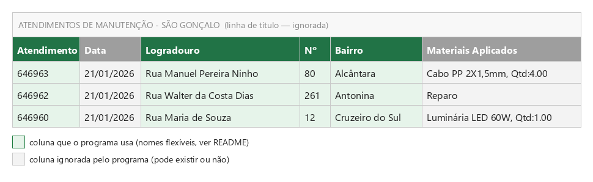
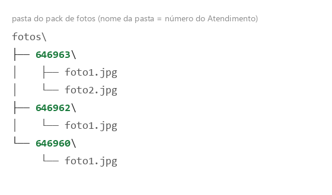

# Relatório Fotográfico

Gera um relatório fotográfico em PDF cruzando os dados de uma **planilha de
atendimentos (.xlsx)** com as **fotos de um pack de fotos** organizado em
pastas por número de atendimento.

Cada página do PDF contém o número sequencial do atendimento, o endereço
(simplificado a partir do dado bruto da planilha) e uma foto correspondente.
Opcionalmente, o relatório recebe uma capa (brasão do contrato, título do
serviço e período/data), seguindo o padrão usado pela Hashimoto.

## Requisitos

- Python 3
- Bibliotecas: `openpyxl`, `Pillow`, `reportlab`

```
pip install openpyxl pillow reportlab
```

## Como usar

Sem argumentos, abre uma janela que guia o preenchimento passo a passo
(planilha, pasta de fotos, pasta de saída e dados da capa):

```
py relatorio_fotografico.py
```

Informando planilha e pasta de fotos diretamente, roda direto no terminal,
sem abrir janela — útil para automatizar:

```
py relatorio_fotografico.py --planilha "C:\contrato_x\atendimentos.xlsx" --fotos "C:\contrato_x\fotos"
```

Também dá pra escolher o PDF de saída e preencher a capa por linha de comando:

```
py relatorio_fotografico.py --planilha "..." --fotos "..." --saida "C:\saida\relatorio.pdf" --contrato sao_goncalo --tipo manutencao --periodo-de 01/01/2026 --periodo-ate 31/01/2026
```

Contratos que usam "MÊS/ANO" na capa em vez de período (ex.: Campos dos
Goytacazes e Cabo Frio, na manutenção) usam `--mes` e `--ano` no lugar de
`--periodo-de`/`--periodo-ate`.

---

## A planilha de atendimentos (.xlsx)

Isso é a parte que mais gera dúvida, então vale a atenção.

O programa lê a **primeira aba** da planilha (ou uma aba chamada
"Atendimentos", se existir — é o caso dos arquivos reais dos contratos, que
têm outras abas como "Materiais Aplicados" e "Pontos Realizados", que são
ignoradas). Dentro dessa aba, ele procura automaticamente a **linha de
cabeçalho** (não precisa ser a primeira linha — pode haver uma linha de
título acima, como nos arquivos reais) e identifica as colunas pelo nome.

Exemplo real (planilha "São Gonçalo - Janeiro 2026"):



Só **4 colunas** são realmente usadas pelo programa:

| Coluna         | Para que serve                                    | Obrigatória? |
|----------------|----------------------------------------------------|:---:|
| **Atendimento** | Número do atendimento — também é o nome da pasta de fotos correspondente (ver seção abaixo) | Sim |
| **Logradouro**  | Nome da rua, usado para montar o endereço          | Sim |
| **Nº**          | Número do imóvel, usado para montar o endereço     | Não (mas recomendado) |
| **Bairro**      | Bairro, usado para montar o endereço               | Não (mas recomendado) |

Todas as outras colunas (Data, Hora Início, Hora Fim, Latitude, Longitude,
Materiais Aplicados, Obs, Maps, Cidade etc.) **podem existir e são
simplesmente ignoradas** — não precisa remover nada da planilha original.

### Os nomes das colunas são flexíveis

O programa não exige o nome exato da coluna: ele compara sem acento e sem
diferenciar maiúsculas/minúsculas, e aceita variações comuns. Por exemplo:

- **Atendimento**: `Atendimento`, `Número Atendimento`, `Nº Atendimento`, `Código Atendimento`
- **Logradouro**: `Logradouro`, `Endereço`, `Rua`
- **Nº** (número do imóvel): `Nº`, `N`, `Num`, `Número Casa`, `Número do Imóvel`
- **Bairro**: `Bairro`
- **Cidade** (opcional, se existir é usada no endereço): `Cidade`, `Município`

Se a planilha do seu contrato usar um nome diferente desses, é só editar o
dicionário `ALIASES_COLUNAS` no início do `relatorio_fotografico.py` e
adicionar o nome usado.

### O que acontece se faltar "Atendimento" ou "Logradouro"

Se o programa não conseguir encontrar as colunas de **Atendimento** e
**Logradouro** em nenhuma linha da planilha, ele para com uma mensagem de
erro — essas duas são indispensáveis. As demais colunas (Nº, Bairro,
Cidade) são opcionais: se não existirem, o endereço simplesmente sai mais
curto (só com o que estiver disponível).

### Linhas sem número de atendimento

Linhas em branco ou sem valor na coluna "Atendimento" são ignoradas
automaticamente (não geram página no PDF).

---

## A pasta do pack de fotos

O programa espera **uma subpasta para cada atendimento**, com o **nome da
pasta igual ao valor da coluna "Atendimento"** na planilha (mesmo número,
como texto). Dentro de cada pasta, uma ou mais imagens.



Regras:

- Formatos de imagem aceitos: `.jpg`, `.jpeg`, `.png`, `.bmp`, `.gif`, `.tiff`, `.webp`.
- Se a pasta tiver mais de uma foto, o programa usa a **primeira em ordem
  alfabética** — só uma foto por atendimento entra no relatório.
- Se não existir pasta para um atendimento (ou a pasta existir mas estiver
  vazia), a página desse atendimento é gerada mesmo assim, mas sem foto
  (com o aviso "Nenhuma foto encontrada para este atendimento"), e ele
  entra na lista de "atendimentos sem foto" no log.
- Se existir uma pasta com fotos cujo nome **não corresponde a nenhum
  atendimento** da planilha (por exemplo, um número de atendimento antigo
  ou digitado errado), essas fotos **não entram no relatório** — a pasta
  aparece na seção "pastas sem atendimento correspondente" do log.

## O log de execução

Toda vez que o PDF é gerado, um arquivo `..._log.txt` é salvo ao lado dele
com um resumo (total de atendimentos, quantos têm foto, quantos não têm) e
o detalhamento de:

- **Atendimentos sem foto** — número e endereço de cada um.
- **Pastas de fotos sem atendimento correspondente** — nome da pasta e
  arquivos dentro dela.

Use esse log para conferir rapidamente se sobrou alguma foto fora do lugar
ou algum atendimento sem registro fotográfico antes de entregar o relatório.

---

## Funcionalidades adicionais

- Simplificação de endereços vindos de geocodificação, removendo CEP,
  "Brasil", região metropolitana etc., mantendo apenas rua, número, bairro
  e cidade.
- Compressão automática das fotos (redimensiona e reconverte para JPEG)
  para não gerar um PDF gigante.
- Geração de capa personalizada por contrato (brasão, título e tipo de
  serviço: Implantação, Manutenção ou Modernização), com suporte a layouts
  específicos por contrato (ex.: Casimiro de Abreu, Porto Real).

## Executável (.exe)

O projeto inclui um build via PyInstaller (`RelatorioFotografico.spec`),
que gera um executável standalone (`RelatorioFotografico.exe`) para uso em
máquinas sem Python instalado, empacotando os assets (brasões/logos) da
pasta `assets/`.
